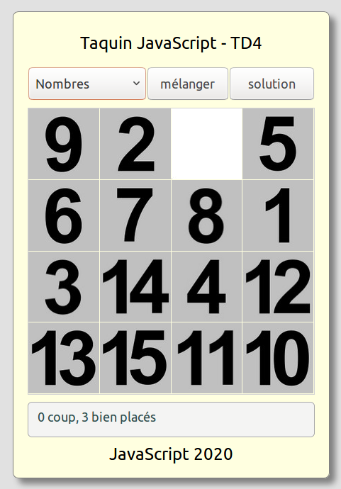

#  Prog web client riche - JavaScript

### IUT Montpellier-Sète – Département Informatique

## TD4
#### _Thème : objets, classes, événements, jeu du taquin_

Cliquez sur le lien ci-dessous pour faire, dans un dossier public_html/JS/TD4, votre fork privé du TD4 (**attention, pas de fork à la main !**):

https://classroom.github.com/a/kOejRRzk

la version [pdf](ressources/td4.pdf)

## INTRODUCTION

Dans ce TD, nous allons réinvestir le travail des trois premiers TD pour créer une version web du jeu du taquin. 

Notre taquin est un puzzle de dimensions 4 lignes et 4 colonnes, soit 16 emplacements. Sur ces 16 emplacements se déplacent 15 carrés portant chacun une partie de l'image complète. L'emplacement sans carré permet aux carrés placés sur les emplacements voisins d'être déplacés sur cet emplacement vide.

L'environnement html-css est déjà opérationnel, mais vous pouvez adapter le css si besoin. 

Vous avez dans le dossier img plusieurs sous-dossiers contenant toutes les images nécessaires pour le jeu. Le nommage des fichiers images est standardisé.  

Le css proposé permet une lecture confortable sur quelques smartphones. Ce sera complété mais ce n'est pas essentiel.

## CONSIGNES

Le travail à accomplir : créer les fichiers JavaScript qui permettent de jouer. 

Vous pouvez donner une version strictement fonctionnelle du jeu, ou alors organiser votre code en classes. C'est à vous de voir. 

## QUELQUES CAPTURES D'ECRAN

### Configuration "puzzle"

Voici le jeu en configuration "puzzle"

   

Au survol, une image "déplaçable" a un curseur souris de type "pointer". Si l'image n'est pas déplaçable, le curseur souris est de type "not-allowed".

Le bouton mélanger, comme son nom l'indique, mélange le puzzle. Il est actif dans la configuration puzzle.

### Configuration "solution"

Le bouton solution, dans la configuration puzzle, permet de basculer sur l'affichage du puzzle résolu. En configuration puzzle, ce bouton affiche le texte solution, et si on passe en configuration solution, alors le texte du bouton se change en "puzzle", et le bouton mélanger est provisoirement désactivé.

Voici le jeu en configuration "solution", une fois pressé le bouton solution (qui devient alors le bouton puzzle)

   

### Changement de thème

Le changement de thème ne fait que modifier l'apparence du puzzle, il ne touche en rien la situation des carrés. Si on change de thème, la vue "solution" est bien entendue actualisée. 

Le sélecteur de thèmes permet de changer le thème du jeu. Le thème par défaut est celui des nombres.

Voici un exemple de thème :

   

### Configuration "puzzle résolu"

Quand le puzzle est résolu, une image réduite vient boucher l'emplacement libre. Plus aucune pièce n'est alors déplaçable, et un message prévient l'utilisateur. 

   

**A VOUS !!!**

